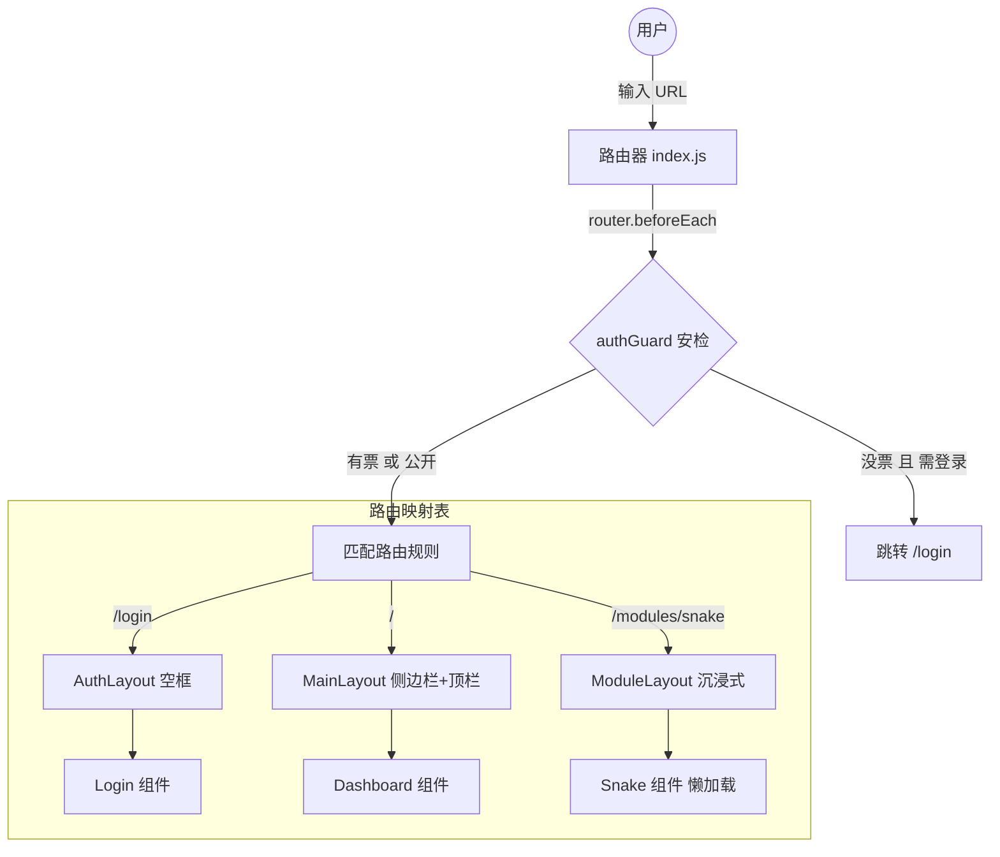
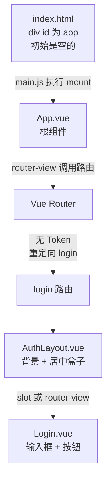

# to do list 
- [ ] 前端所有一级文件夹是干什么的


# 启动流程
- 启动前端5173：


# 文件结构
这次，我们已经成功完成了一个功能的添加，接下来进行一个更加复杂的内容的构建：个人博客，同时加上许多的插件功能，现在首先要有三个：贪吃蛇(java实现)，俄罗斯方块(由python实现)，以及AI心情分析器。这个新的项目架构如下：
/home/zzn16/Full_stack_study/personal-portal/
├── docs/                        # 数据库 Schema 设计、Auth 逻辑说明、API 接口文档
├── scripts/                     # 自动化脚本
│   ├── init_db.sh               # 初始化本地 H2 和 SQLite 数据库脚本
│   ├── dev.sh                   # 一键启动：Vite(5173) + SpringBoot(8080) + FastAPI(8000)
│   └── build.sh                 # 自动化打包并将 dist 迁移至 SpringBoot static 目录
│
├── portal-frontend/             # 【前端：Vue3 + Vite + Pinia】
│   ├── src/
│   │   ├── api/                 # Axios 封装：包含 Auth 拦截器（请求自动带上 Token）
│   │   ├── assets/              # 全局样式、图标、Alex 风格头像
│   │   ├── components/          # 全局通用 UI（功能卡片 FeatureCard.vue、弹窗）
│   │   ├── layouts/             # 【嵌套 UI 布局层】
│   │   │   ├── MainLayout.vue   # 基础框架：左侧 Alex 信息栏 + 右侧功能 RouterView
│   │   │   ├── AuthLayout.vue   # 简洁布局：仅用于登录和注册页面
│   │   │   └── ModuleLayout.vue # 插件内部容器：带返回按钮和模块标题的子布局
│   │   ├── middleware/          # 【路由守卫】校验用户登录状态（检查本地存储的 Token）
│   │   │   └── authGuard.js     
│   │   ├── modules/             # 【功能插件箱：业务逻辑物理隔离】
│   │   │   ├── mood/            # --- AI 心情模块 ---
│   │   │   │   ├── MoodMain.vue
│   │   │   │   └── router.js    # 模块私有路由
│   │   │   ├── snake-java/      # --- Java 贪吃蛇前端 --- (与 8080 端口通信)
│   │   │   │   ├── SnakeMain.vue
│   │   │   │   └── components/
│   │   │   ├── tetris-py/       # --- Python 俄罗斯方块前端 --- (与 8000 端口通信)
│   │   │   │   ├── TetrisMain.vue
│   │   │   │   └── components/
│   │   │   └── blog/            # --- 个人博客模块 --- (无需登录即可访问)
│   │   │       └── BlogView.vue
│   │   ├── views/               # 平台基础视图
│   │   │   ├── Dashboard.vue    # 仪表盘：读取注册表，若未登录则显示锁定图标
│   │   │   └── Login.vue        # 登录页：包含正则校验逻辑（如邮箱、密码强度）
│   │   ├── router/              # 路由总控
│   │   │   └── index.js         # 整合所有 modules 路由，应用 authGuard
│   │   ├── registry/            # 【功能注册表】
│   │   │   └── featureList.js   # 定义：ID、标题、是否需要登录、路由路径
│   │   ├── App.vue
│   │   └── main.js
│   └── vite.config.js           # 配置代理解决跨域
│
├── portal-backend/              # 【主后端：Spring Boot + H2 数据库】
│   ├── src/main/java/com/drzhao/portal/
│   │   ├── common/              # 全局统一 Result 返回体、枚举、异常拦截器
│   │   ├── infrastructure/      # 基础设施层
│   │   │   ├── config/          # H2 数据库连接配置、CORS 配置
│   │   │   └── security/        # JWT 或 Session 鉴权核心配置
│   │   └── modules/             # 【后端业务插件包】
│   │       ├── auth/            # --- 登录鉴权模块 ---
│   │       │   ├── AuthController.java # 接收登录请求、注销
│   │       │   ├── AuthService.java    # 编写密码加密与格式验证逻辑
│   │       │   └── UserRepository.java # 对接本地 H2 数据库中的用户表
│   │       ├── game/            # --- 游戏模块：Java 贪吃蛇 ---
│   │       │   ├── SnakeController.java
│   │       │   ├── SnakeService.java   # 处理蛇的坐标、长度及排行榜结算
│   │       │   └── ScoreRepository.java # 记录最高分到 H2
│   │       └── blog/            # --- 博客管理 --- (读写本地 H2)
│   ├── src/main/resources/
│   │   ├── db/                  # SQL 脚本 (schema.sql 定义表结构, data.sql 初始化数据)
│   │   └── application.yml      # 配置本地 H2 数据库存储路径 (data/portal.db)
│   ├── data/                    # 【本地数据库文件】存放 portal.db
│   └── pom.xml
│
└── python-backend/                 # 【子后端：FastAPI + SQLite】
    ├── app/
    │   ├── database/            # SQLite 数据库连接器 (用于存储 Python 侧游戏数据)
    │   │   └── session.py
    │   ├── core/                # 核心算法：情绪分析逻辑
    │   ├── routers/             # 功能路由
    │   │   ├── mood.py          # /analyze 接口
    │   │   └── tetris        # --- Python 俄罗斯方块逻辑 --- (计分与存储)
    │   │       ├── logic.py     # 游戏内核逻辑
    │   │       └── crud.py      # 读取/保存俄罗斯方块得分至 SQLite
    │   ├── schemas/             # Pydantic 响应与请求模型
    │   └── main.py              # FastAPI 入口
    ├── data/                    # 【本地数据库文件】存放 ai_tools.db
    └── requirements.txt


我们对于这个架构进行讲解：
首先，项目分成三层：
1，potal-frontend：前端，使用vue3 + vite + pinia + element-plus，
2，portal-backend：后端，使用springboot + h2数据库 + jwt + 
3，python-backend：后端，使用fastapi + sqlite数据库 + jwt + 
前端任务：画出界面，同时接受用户信息，和java后端或者python后端进行交互。
后端：算法处理，数据库存储，用户信息处理。

# 前端代码：portal-frontend
我们整体来说，可以将前端分成五大类：

## 础设施配置 (Infrastructure)
[跨域代理配置中心](../portal-frontend/vite.config.js)(具体的讲解我会在代码中进行说明)
这个是构建工具vite的配置文件，一共有四个作用：
1，给路径起别名：`@` -> `/src`
2，设置前端端口：5173
3，转发java后端：8080，同时修饰地址，去掉前端发送的`/api/java`，比如前端发送`/api/java/auth/login`，后端收`/auth/login`
4，转发python后端：8000，同时修饰地址，去掉前端发送的`/api/python`，比如前端发送`/api/python/analyze`，后端收`/analyze`
```json
  server: {
    port: 5173,
    proxy: {
      // Java 后端代理 (Spring Boot)
      '/api/java': {
        target: 'http://localhost:8080',
        changeOrigin: true,
        rewrite: (path) => path.replace(/^\/api\/java/, '/api') 
        // 例子: 前端发 /api/java/auth/login -> 后端收 /api/auth/login
      },
      // Python 后端代理 (FastAPI)
      '/api/python': {
        target: 'http://localhost:8000',
        changeOrigin: true,
        rewrite: (path) => path.replace(/^\/api\/python/, '') 
        // 例子: 前端发 /api/python/analyze -> 后端收 /analyze
      }
    }
  }
```
[程序的总指挥](../portal-frontend/src/main.js)
这个是项目的**入口文件**，一共有3个作用：
1，制造原型 `const app = createApp(App)`
2，安装拓展模块 `app.use(...)`
3，挂载原型，启动项目 `app.mount('#app')`
```javascript
const app = createApp(App)
app.use(createPinia())
app.use(router)
app.mount('#app')
```


[根组件](../portal-frontend/src/App.vue)
首先，根组件`App.vue`是由三个内容组成的：`template`，`script`，`style`;分别对应`HTML`，`JS`，`CSS`。
这几个部分中，**HTML**是必须要有的，**JS**和**CSS**是可选的。
但是！作为根组件，我们只需要有这个内容就可以了。
```vue
<template>
  <router-view />
</template>
```
这个代码的意义是路由视图，即对于一个地址，可以显示不同的内容。
比如我撰写两个.vue文件，一个叫home.vue，一个叫class.vue，那么我就可以在App.vue中使用`<router-view />`来显示不同的内容。
```vue
<template>
  <div class="home">
    <h1>欢迎来到第一中学</h1>
    <p>今天食堂有红烧肉。</p>
  </div>
</template>
```
```vue
<template>
  <div class="math-class">
    <h1>数学教室</h1>
    <p>今天的作业是微积分。</p>
  </div>
</template>
```
然后我再配置一个路由表：
```javascript
const routes = [
  { path: '/', component: Home },      // / -> 显示 Home
  { path: '/math', component: Math }   // /math -> 显示 Math
]
```
当用户访问http://localhost:3000/的时候，识别为/，所以会显示Home.vue的内容。
当用户访问http://localhost:3000/math的时候，识别为/math，所以会显示Math.vue的内容。
这样的好处就是在App.vue中，只需要写`<router-view />`，然后切换页面只需要更改HTML中的内容，css可以保持一致，加快运行速度。换而言之：这样可以记住**状态**。

---
api层有很多文件，但是只有一个`request.js`,其他文件都是传菜员，但是`request.js`是厨房的总厨，他负责将需求送到其他api的手中，所以这个也要放在api层。

## 网络通信层

[网络请求封装](../portal-frontend/src/api/request.js)
整个项目做了一件大事情，可以分成三个小事情
**大事情**：网络请求封装
**小事情1**：设置超时时间(如果超过5秒没有响应，就取消请求)
**小事情2**：出门安检：每次发请求前，代码会自动检查浏览器本地（LocalStorage）有没有 Token。如果有，就把它贴在信封的头部（Headers），然后交给服务器的保安。
**小事情3**：统一处理结果（成功就拿数据；如果服务器说 Token 过期 (401)，就自动踢回登录页）。
**注意**：token的来龙去脉是这样的，首先用户注册，会在服务器产生一个token，然后将token贴在浏览器的本地（LocalStorage）上，然后每次发请求前，代码会自动检查浏览器本地（LocalStorage）有没有 Token。如果有，就把它贴在信封的头部（Headers），然后交给服务器的保安。
这些工作都是在后端完成的。


[登录请求](../portal-frontend/src/api/auth.js)
封装了两个内容：登录和注册
如果用户访问`/api/java/auth/login`，就会调用`login`函数，
如果用户访问`/api/java/auth/register`，就会调用`register`函数，

## 路由与注册表 (Router & Registry)

[功能列表](../portal-frontend/src/registry/featureList.js)
这个简答，我们以其中一个为例：

```javascript
  { 
    id: 'mood', //这个组件的唯一标识符
    title: 'AI 心情气象台', //标题
    description: '分析你的文本情绪', //描述
    icon: '🌤️', //图标
    path: '/modules/mood', //路径
    requireAuth: true,//是否需要登录，如果是false，就是允许游客访问。
    backend: 'python' // 标记后端类型，仅用于展示或逻辑判断
  }
```


[路由守卫](../portal-frontend/src/middleware/authGuard.js)
这个代码主要部分负责是否需要登陆。

1，导入功能列表
```javascript
import { features } from '@/registry/featureList'
```
这个表示从`src/registry/featureList.js`中导入`features`。`@`是`src`的别名，
2，导出函数
```javascript
export function authGuard(to, from, next) { ... }
```
这个表示导出一个函数`authGuard`，这个函数有三个参数：`to`，`from`，`next`。
`to`表示目标路由，`from`表示来源路由，`next`表示放行开关。这个类似于一个跳转逻辑。

3，找到文件
```javascript
const targetFeature = features.find(f => to.path.startsWith(f.path))
```
这个表示从`features`中找到`to.path`开头的`feature`。也就是去`portal-frontend/src/registry/featureList.js`中找到`to.path`开头的相关文件。

4，判断是否需要登录
```javascript
const requireAuth = targetFeature ? targetFeature.requireAuth : false
const token = localStorage.getItem('token')
```
这个表示从`features`中找到`to.path`开头的`feature`。也就是去`portal-frontend/src/registry/featureList.js`中找到`to.path`开头的相关文件。

5，最终的动作决定
```javascript
if (requireAuth && !token) {
  // 这里的 && 意思是“并且”
  // 如果：(这地方需要登录) 并且 (你没有 Token)
  
  next('/login') // 动作：滚回去登录！
} else {
  // 否则（这地方不需要登录，或者你有 Token）
  
  next() // 动作：请进！
}
```

[路由总配置](../portal-frontend/src/router/index.js)
整体来讲，这个代码做了三件事情：
1. **绘制了地图**：定义了 URL（地址）与 Vue 组件（页面）之间的映射关系（输入什么网址，显示什么页面）。
2. **构建了骨架**：通过嵌套路由（Layout + Children），决定了不同类型的页面使用不同的外观框架（登录页 vs 主页 vs 游戏页）。
3. **设立了安检**：通过`router.beforeEach(authGuard)`，在用户访问任何页面前，检查是否需要登录，如果需要且没有登录，就跳转到登录页。

这个相当于对于每一个功能都构建了路由，建立了映射



## 布局系统 (Layouts)

[主布局](../portal-frontend/src/layouts/MainLayout.vue)


[模块布局](../portal-frontend/src/layouts/ModuleLayout.vue)

[登录布局](../portal-frontend/src/layouts/AuthLayout.vue)
目前为空。 作用：这是一个极简的容器，专门用于登录页。它不需要侧边栏，只需要把登录框居中。

[登录页面](../portal-frontend/src/views/Login.vue)
用户输入表单。点击登录后，会调用 api/auth.js，拿到 Token 存入本地，然后跳转仪表盘。


## 核心业务模块


[仪表盘](../portal-frontend/src/views/Dashboard.vue)
这是用户登录后的主页面。它会展示所有可用的功能模块，每个模块都有一个卡片，点击卡片可以进入对应的模块页面。


[贪吃蛇游戏主界面](../portal-frontend/src/modules/snake-java/SnakeMain.vue)


[俄罗斯方块游戏主界面](../portal-frontend/src/modules/tetris-py/TetrisMain.vue)


[情绪分析主界面](../portal-frontend/src/modules/mood/MoodMain.vue)
AI 心情分析的前端界面。它展示了如何调用 api/python 接口。


[博客主界面](../portal-frontend/src/modules/blog/BlogView.vue)
这是一个展示列表的页面。因为你的博客内容存储在 Java (H2 数据库) 中，所以这里需要调用 Java API。


# 前端启动的步骤

## `npm install`
首先，写好代码之后，我们会撰写`package.json`文件，这个文件有这几个核心部分：
1. 身份识别区
项目名称`name`:portal-frontend
项目版本`version`:1.0.0
私有保护`private`:true(禁止发布到公共的npm环境，防止内容泄露)
模块类型`type`:module(使用ES模块语法)
```json
{
  "name": "portal-frontend",
  "version": "1.0.0",
  "private": true,
  "type": "module"
}
```
2. 脚本区(别名)
npm run dev: 启动开发服务器       `npm run dev` 相当于 `vite`
npm run build: 构建生产版本       `npm run build` 相当于 `vite build`
npm run preview: 预览生产版本     `npm run preview` 相当于 `vite preview`

```json
"scripts": 
  {
    "dev": "vite",
    "build": "vite build",
    "preview": "vite preview"
  }
```
3. 生产环境依赖
这里的包，是**用户浏览器运行时必须用到的代码**。如果没有这些，网页在用户的浏览器里就跑不起来。可以理解为做菜用的食材。
```json
"dependencies": 
  {
    "axios": "^1.6.0",
    "pinia": "^2.1.0",
    "vue": "^3.4.0",
    "vue-router": "^4.2.0"
  }
```
`axios`: "^1.6.0"
用途：一个 HTTP 客户端。
作用：前端用来向你的 Java 后端发送请求（GET/POST），获取数据。没有它，前端就是个孤岛。
`pinia`: "^2.1.0"
用途：Vue 的状态管理库（Vuex 的继任者）。
作用：用来存储全局共享的数据，比如“当前登录的用户是谁”、“购物车里有什么”。它像一个全局的大脑记忆区。
`vue`: "^3.4.0"
用途：Vue 框架的核心代码。
作用：整个网页的基石。所有 .vue 组件的渲染、响应式数据变化，都靠它。
`vue-router`: "^4.2.0"
用途：Vue 的路由管理器。
作用：负责页面跳转（比如从 /login 跳到 /home），但页面不刷新。
4. 开发环境依赖
这里的包，**只在开发阶段（写代码、打包时）有用**。 当项目打包上线后，用户的浏览器不需要这些代码。可以理解为做菜用的厨具（锅、铲子、微波炉）。客人吃菜，不需要把锅也端上去吃掉。
```json
"devDependencies": 
  {
    "@vitejs/plugin-vue": "^5.0.0",
    "vite": "^5.0.0"
  }
```
`vite`: "^5.0.0"
身份：构建工具（厨具之王）。
作用：它负责启动服务器、热更新、打包代码。用户的浏览器不需要运行 Vite，浏览器只需要 Vite 产出的结果。
`@vitejs/plugin-vue`: "^5.0.0"
身份：Vite 的 Vue 翻译官（插件）。
作用：Vite 本身只懂 JS，不懂.vue 文件。这个插件教 Vite 如何把.vue 文件里的 `<template>, <script>, <style> `拆解并翻译成浏览器能懂的 JavaScript。


---

运行npm run build之后，相当于将**生产环境依赖**和**开发环境依赖**两个内容下载到了node_modules文件夹中。

---
`npm run dev`
首先，npm去`package.json`中找到`scripts`字段，然后找到`dev`字段，然后执行`vite`命令。
vite会启动一个本地的node服务器，监听端口，并且实时编译vue文件，然后开始真正的前端启动流程。

### 浏览器访问入口文件[index.html](../portal-frontend/index.html)
浏览器访问`http://localhost:5173/`，会默认返回`index.html`文件(这个是浏览器的规则)，然后浏览器开始解析`index.html`文件。

1. 浏览器访问的[index.html](../portal-frontend/index.html)文件中，会找到`<script type="module" src="/src/main.js"></script>`，首先浏览器看到`type="module"`，说明这是一个ES6模块，然后浏览器会发起一个请求，下载[main.js](../portal-frontend/src/main.js)文件。
当前，页面上还是`<div id="app"></div>`，什么都没有。

2. [main.js](../portal-frontend/src/main.js)文件中，把Vue的核心(createApp)、你的根组件(App.vue)，路由(router)，状态管理(pinia)全部引入内存。
```javascript
const app = createApp(App)
app.use(createPinia())
app.use(router)
app.mount('#app')
```
最后一步`app.mount('#app')`是将Vue实例挂载到`#app`元素上，也就是`index.html`中的`<div id="app"></div>`。接下来，vue将正式接管`<div id="app"></div>`，开始渲染你的应用。

3. [App.vue](../portal-frontend/src/App.vue)
vue接管`<div id="app"></div>`后，开始渲染你的应用。[App.vue](../portal-frontend/src/App.vue)是你的根组件(模板组件)，它会根据路由(router)决定挂载哪个界面，同时通过`pinia`来管理组件内部的数据状态。

在[App.vue](../portal-frontend/src/App.vue)中，你会看到`<router-view />`，它会根据路由(router)来渲染不同的页面，然后`<router-view />`会被路由系统介入。

**首先**，他会触发守卫`import { authGuard } from '@/middleware/authGuard'`，守卫会监测每一个跳转，检查其是否合法。

**然后**，Router会检查当前浏览器的地址是`/`，然后查阅地图，在[router/index.js](../portal-frontend/src/router/index.js)中找到对应的路由配置，然后渲染对应的组件。
```javascript
const MoodMain = () => import('@/modules/mood/MoodMain.vue')
const SnakeMain = () => import('@/modules/snake-java/SnakeMain.vue')
const TetrisMain = () => import('@/modules/tetris-py/TetrisMain.vue')
const BlogView = () => import('@/modules/blog/BlogView.vue')
```
我们举一个具体的流程例子：
比如用户要访问`/modules/mood`
    Router要解析这个URL
    Router拿着这个URL，去从上往下找一个匹配的路由配置
        /login → AuthLayout → (child '') Login
        / → MainLayout → (child '') Dashboard
        /modules → ModuleLayout → children: mood/snake/tetris/blog
    然后进行authGuard检查,确保无误之后进行下一步操作
    根据匹配链，Router会先匹配到`/modules`，然后继续匹配`/modules/mood`，最后渲染`MoodMain`组件
    最后触发渲染，Router 把“匹配链”交给` <router-view> `系统，页面变化


| 步骤                 | 主要责任                                | 你项目里的关键文件                                                                                                                      |
| ------------------ | ----------------------------------- | ------------------------------------------------------------------------------------------------------------------------------ |
| 解析 URL             | 读当前地址栏 `/`、`/login`、`/modules/mood` | [src/main.js](../portal-frontend/src/main.js)（挂载 router）、[src/router/index.js](../portal-frontend/src/router/index.js)（创建 router），真正解析逻辑在 `vue-router` 库内部                                             |
| 匹配路由表              | 找出应该用哪个布局、哪个页面组件                    | [src/router/index.js](../portal-frontend/src/router/index.js)（`routes` 数组），以及里边引用的 `layouts/*.vue`、`views/*.vue`、`modules/**/*.vue`                                    |
| 执行守卫               | 决定这次跳转放行、重定向还是拦截                    | [src/middleware/authGuard.js](../portal-frontend/src/middleware/authGuard.js)（守卫函数）、`src/router/index.js`（`router.beforeEach(authGuard)`）                                      |
| 加载组件               | 同步加载布局/视图，懒加载模块组件                   | `src/layouts/*.vue`、`src/views/*.vue`、`src/modules/*/*.vue`（尤其是通过 `() => import()` 懒加载的）                                       |
| 更新 history         | 改变浏览器地址但不刷新页面                       | [src/router/index.js](../portal-frontend/src/router/index.js) 里 `createWebHistory()`，内部实现在 `vue-router` 和浏览器 `window.history`                                          |
| `<router-view>` 渲染 | 把匹配到的组件真正“画”到页面上                    | [src/App.vue](../portal-frontend/src/App.vue)（根 `<router-view />`）、[src/layouts/MainLayout.vue](../portal-frontend/src/layouts/MainLayout.vue) / [src/layouts/AuthLayout.vue](../portal-frontend/src/layouts/AuthLayout.vue) / [src/layouts/ModuleLayout.vue](../portal-frontend/src/layouts/ModuleLayout.vue)（嵌套的 `<router-view />`） |


---

综上所述，前端的灵魂就是[index.html](../portal-frontend/index.html),[vite.config.js](../portal-frontend/vite.config.js),[package.json](../portal-frontend/package.json)这三个文件。


# 后端搭建

首先，我们要理解后端由哪些内容构成。
## 核心配置文件

- [核心配置文件pom.xml](../portal-backend/pom.xml)

这个是一个配置文件，用于配置后端项目依赖的库和插件等，类似前端的[package.json](../portal-frontend/package.json)

<br/>

整体来讲，这个文件就是
只要有这个文件在，任何一个程序员（或者是你），在任何一台安装了Java和Maven的电脑上，只需要输入一行命令：
`mvn clean package`
Maven就会根据这张蓝图：
自动下载所有的Web服务器、数据库驱动、安全组件。
自动编译你的Java代码。
自动组装所有部件。
吐出一个名为`portal-backend-0.0.1-SNAPSHOT.jar`的文件。
这个jar(Java ARchive)文件就是我们后端的可执行文件，我们可以直接运行它来启动后端服务。
jar文件主要有三个内容：
1. 编译后的.class文件
2. 资源文件（如配置文件、静态资源等）
3. 说明书`META-INF`,准确来讲这个是`MANIFEST.MF`这个文件,上面写着：

```
Manifest-Version: 1.0
Main-Class: com.drzhao.MainApp
```
也就是
```
你好，Java 虚拟机。当你运行这个罐子时，请先找到 com.drzhao.MainApp 这个类，它是程序的入口（Main Class），请从这里开始执行！
```


- [数据集存放](../portal-backend/data) 这个主要存放所有的数据集


- [代码主目录](../portal-backend/src) 这个主要存放所有的代码内容

```markdown
main
├── java                这个目录下存放所有的Java代码
│   └── com
└── resources           这个目录下存放所有的资源和配置文件
    ├── application.yml
    └── db
```
我们先来看资源和配置文件
## 资源和配置文件
(../portal-backend/src/main/resources)

- 项目的总开关[application.yml](../portal-backend/src/main/resources/application.yml) 是Spring Boot的配置文件，用于配置数据库连接、服务器端口等。
```yml
server:
  port: 8080  #这个说明了服务器的端口号是8080
spring:
  application:
    name: portal-backend  #这个说明了应用的名字是portal-backend
  datasource:
    url: jdbc:h2:mem:testdb  #这个说明了数据库的地址是jdbc:h2:mem:testdb
    driver-class-name: org.h2.Driver  #这个说明了数据库的驱动类是org.h2.Driver
    username: sa  #这个说明了数据库的用户名是sa
    password:  #这个说明了数据库的密码是空

  h2:
    console:
      enabled: true  #这个说明了h2控制台是启用的
    
jwt:
  secret: MySuperSecretKeyForDrZhaoPortal2026DoNotShareThisMustBeLongEnough # 密钥必须足够长
  expiration: 86400000 # Token 有效期 24小时 (毫秒)
```

<br/>

- [db](../portal-backend/src/main/resources/db) 是数据库脚本文件，用于初始化数据库。
  - [schema.sql](../portal-backend/src/main/resources/db/schema.sql) 是数据库表结构文件，用于创建数据库表。**注意这个是定义数据库结构的核心 SQL 脚本文件**
```sql
CREATE TABLE IF NOT EXISTS users (
    id BIGINT GENERATED BY DEFAULT AS IDENTITY PRIMARY KEY,
    username VARCHAR(50) NOT NULL UNIQUE,
    password VARCHAR(255) NOT NULL,
    nickname VARCHAR(50),
    email VARCHAR(100),
    role VARCHAR(20) DEFAULT 'USER',
    created_at TIMESTAMP DEFAULT CURRENT_TIMESTAMP,
    updated_at TIMESTAMP DEFAULT CURRENT_TIMESTAMP
);
```
这个的主要功能是生成用户表`user`，包含用户的基本信息和权限。
用户的基本信息有：用户名、密码、昵称、邮箱、角色、创建时间、更新时间。
权限有：USER、ADMIN。(默认生成user,但是可以在后台手动修改成admin)
  - [data.sql](../portal-backend/src/main/resources/db/data.sql) 是数据库数据文件，用于插入初始数据。
```sql
-- 插入管理员账户 (密码是 123456)
-- 使用 MERGE INTO 或 WHERE NOT EXISTS 防止重复插入报错
MERGE INTO users (username, password, nickname, role, email) 
KEY(username) 
VALUES ('admin', '$2a$10$N.zmdr9k7uOCQb376No.1.x.q/Vq.x/Vq.x/Vq.x/Vq.x/Vq', 'Dr.Zhao', 'ADMIN', 'admin@portal.com');
```
初始化数据，默认信息如下:
- 用户名: admin
- 密码: 123456
- 昵称: Dr.Zhao
- 角色: ADMIN
- 邮箱: admin@portal.com


## 源代码


### 基础设施与公共类 (Infrastructure & Common)
- 整个后端的启动目录[PortalApplication.java](../portal-backend/src/main/java/com/drzhao/portal/PortalApplication.java)


- 统一前后端交互格式[Result.java](../portal-backend/src/main/java/com/drzhao/portal/common/Result.java)


- 生成和解析token[JwtUtil.java](../portal-backend/src/main/java/com/drzhao/portal/util/JwtUtil.java)


- Spring Security 配置，开放登录接口，配置密码加密器：[SecurityConfig.java](../portal-backend/src/main/java/com/drzhao/portal/infrastructure/config/SecurityConfig.java)


- 跨域配置:允许`5173`端口的前端访问`8080`的后端[CorsConfig.java](../portal-backend/src/main/java/com/drzhao/portal/infrastructure/config/CorsConfig.java)


- 全局异常处理[exception/GlobalExceptionHandler.java](../portal-backend/src/main/java/com/drzhao/portal/infrastructure/exception/GlobalExceptionHandler.java)

### 业务模块：认证
把数据库 users 表映射成 Java 对象[User.java](../portal-backend/src/main/java/com/drzhao/portal/modules/auth/model/User.java)


把“查用户”“保存用户”这种数据库操作封装成接口，AuthService 直接调用它即可[UserRepository.java](../portal-backend/src/main/java/com/drzhao/portal/modules/auth/UserRepository.java)


处理登录逻辑（校验密码、生成 Token）[AuthService.java](../portal-backend/src/main/java/com/drzhao/portal/modules/auth/AuthService.java)


对外提供 HTTP API；负责“接收参数 + 调用 Service + 返回统一格式”[AuthController.java](../portal-backend/src/main/java/com/drzhao/portal/modules/auth/AuthController.java)

Spring Boot 启动时的数据初始化器：应用一启动就会跑一遍，用来在数据库里自动创建一个默认管理员账号[DataInitializer.java](../portal-backend/src/main/java/com/drzhao/portal/infrastructure/config/DataInitializer.java)


### 具体的模块内容

---
贪吃蛇模块
---

- 把数据库表snake_scores映射成Java对象SnakeScore:[SnakeScore](../portal-backend/src/main/java/com/drzhao/portal/modules/game/snake/model/SnakeScore.java)

- 封装对 snake_scores 表的查询与保存:[ScoreRepository](../portal-backend/src/main/java/com/drzhao/portal/modules/game/snake/repository/ScoreRepository.java)

- 提交分数，获取排行榜:[SnakeService](../portal-backend/src/main/java/com/drzhao/portal/modules/game/snake/service/SnakeService.java)

- 对外提供 HTTP API:[SnakeController](../portal-backend/src/main/java/com/drzhao/portal/modules/game/snake/controller/SnakeController.java)

---
博客模块
---
映射 blog_posts 表:[BlogPost](../portal-backend/src/main/java/com/drzhao/portal/modules/blog/model/BlogPost.java)

定义对外 API[BlogController](../portal-backend/src/main/java/com/drzhao/portal/modules/blog/controller/BlogController.java)

把博客业务规则集中管理，Controller 只做“接线”:[BlogService](../portal-backend/src/main/java/com/drzhao/portal/modules/blog/service/BlogService.java)


提供Java对于数据库的增删查改(CRUD)功能:[BlogRepository](../portal-backend/src/main/java/com/drzhao/portal/modules/blog/repository/BlogRepository.java)


# 启动后端
```bash
cd ~/Full_stack_study/personal-portal/portal-backend
mvn clean spring-boot:run
```


